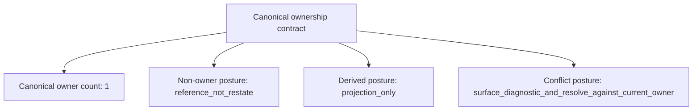

<!-- GENERATED — DO NOT EDIT -->
# Authority, Ownership, and Relationships

[Previous: Applicability and Selection](003-applicability-and-selection.md) | [Next: Layering](005-layering.md) | [Index](000-index.md)

Every governed fact has one current canonical owner. Other artifacts can reference or project that fact, but they do not become independent authority by repeating it.

## Canonical ownership

The ownership contract assigns one current canonical owner to each governed fact. Non-owners reference rather than restate authority, derived artifacts remain projections, and ownership conflicts are surfaced and resolved against the current owner.

Every governed fact MUST have exactly one current canonical owner.

A non-owning MRD or repository artifact MAY summarize or project an owned fact for its audience but MUST reference the canonical owner and MUST NOT redefine the fact as independent authority.

Generated HRDs, indexes, dependency maps, and other META projections MUST remain downstream of their canonical sources and MUST NOT become write-back authority.

## Authority and ownership model

The diagram groups the four fields of the canonical ownership contract. Connector lines show contract composition only; they do not invent relationships between governed actors.

## Canonical owner kinds

The following table identifies the kinds of sources that can own governed facts:

| Kind | Meaning |
|---|---|
| `prescriptive_mrd` | Machine-readable governance or product authority intentionally adopted as the canonical owner. |
| `executable_repo_source` | Code, configuration, schema, contract, or test that canonically owns an executable fact under repository authority routing. |
| `parent_governance_source` | A higher-authority KIS source that remains canonical until a governed adoption changes ownership. |

## Governed relationships

Non-owning artifacts preserve authority by declaring typed relationships to the sources they depend on, implement, evidence, project, or reference. The vocabulary is governed and closed; ad hoc labels cannot create new relationship semantics.

See the [governed relationship vocabulary](021-relationship-vocabulary.md) for every relationship code and meaning.

Relationships between governed artifacts MUST use the governed relationship vocabulary; ad hoc relationship labels MUST NOT silently create new semantics.

When two sources appear to own the same current fact, kis-op MUST surface the conflict and resolve ownership through the applicable authority order before accepting dependent work.

Supersession MUST preserve the previous owner's stable identity and lineage while making the replacement unambiguous.

## Requirement traceability

The following table preserves the stable rule identifier and enforcement binding for each requirement stated in this chapter:

| Rule | Enforcement |
|---|---|
| `KIS-MRD-OWN-001` | `review` |
| `KIS-MRD-OWN-002` | `review` |
| `KIS-MRD-OWN-003` | `generator` |
| `KIS-MRD-OWN-004` | `validator` |
| `KIS-MRD-OWN-005` | `workflow` |
| `KIS-MRD-OWN-006` | `validator` |

## Source and authority

This page projects `urn:uuid:9a543068-203b-5a7a-8cdb-805517ca3487` version `1.0.0`. The MRD remains authoritative; this page has no write-back authority.
