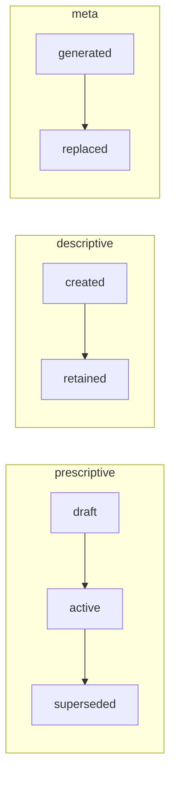

<!-- GENERATED — DO NOT EDIT -->
# Lifecycle

[Previous: Provenance](007-provenance.md) | [Next: Validation and Enforcement](009-validation-and-enforcement.md) | [Index](000-index.md)

MRD lifecycle depends on record mode. Prescriptive authority, descriptive evidence, and generated metadata follow different states and mutability rules.

## Lifecycle diagram

Each record mode is shown as its own canonical state machine. Only transitions declared by the lifecycle MRD are drawn.

## State machines

Each record mode has its own state machine. Prescriptive MRDs move from draft authority to active authority and then supersession; descriptive evidence and generated metadata use lifecycles that match their different mutability rules.

The following table shows the allowed states and transitions for each record mode:

| Record mode | States | Allowed transitions |
|---|---|---|
| `prescriptive` | draft → active → superseded | draft → active; active → superseded |
| `descriptive` | created → retained | created → retained |
| `meta` | generated → replaced | generated → replaced |

## Lifecycle requirements

Active prescriptive MRDs MUST have resolved dependencies and valid provenance.

Descriptive EVD records MUST be immutable after creation.

META records MUST be regenerated from their sources rather than manually maintained.

A derived or generated artifact MUST be treated as stale when its declared source fingerprint no longer matches its admitted sources.

Superseded MRDs MUST remain addressable for lineage and MUST identify their replacement when one exists.

Git history is the change history; a duplicate body changelog is not required by the core MRD standard.

## Requirement traceability

The following table preserves the stable rule identifier and enforcement binding for each requirement stated in this chapter:

| Rule | Enforcement |
|---|---|
| `KIS-MRD-LIFE-001` | `validator` |
| `KIS-MRD-LIFE-002` | `workflow` |
| `KIS-MRD-LIFE-003` | `generator` |
| `KIS-MRD-LIFE-004` | `generator` |
| `KIS-MRD-LIFE-005` | `validator` |
| `KIS-MRD-LIFE-006` | `review` |

## Source and authority

This page projects `urn:uuid:ddc10bf4-e6ea-5b3a-958e-464af2fa9fd1` version `1.0.0`. The MRD remains authoritative; this page has no write-back authority.
