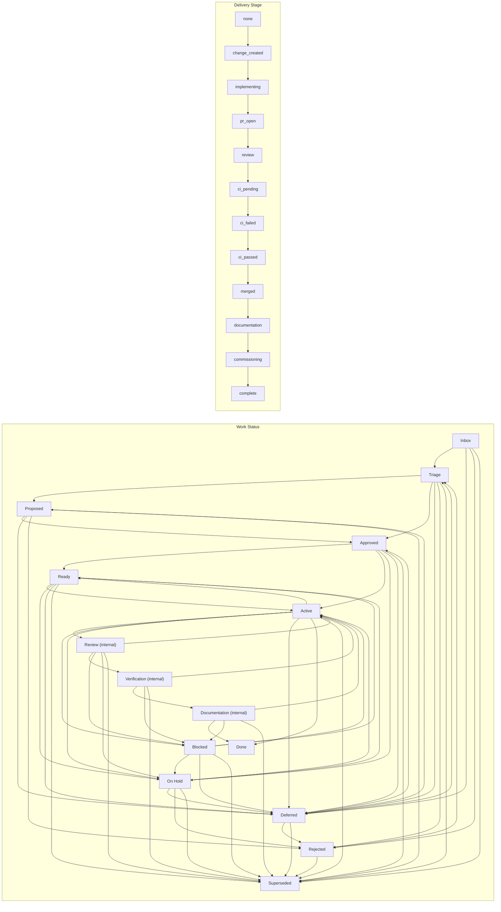

<!-- GENERATED — DO NOT EDIT -->
# Work lifecycle

[Previous: Work Management domain model](002-work-management-domain-model.md) | [Next: Work operations](004-work-operations.md) | [Index](000-index.md)

A work item moves through explicit states. Project-visible states describe the shared work queue, while internal states such as Review, Verification, and Documentation describe delivery activity without creating new GitHub Project status values.

## Work status and delivery stage

Work Status and Delivery Stage are separate dimensions. The diagram shows the canonical Work lifecycle graph and Delivery Stage sequence independently; it does not map a work state to a delivery stage.

## State model

| State | Meaning | GitHub Project status | Token |
|---|---|---|---|
| Inbox | Captured work not yet triaged. | Yes | `inbox` |
| Triage | Work being classified. | Yes | `triage` |
| Proposed | Work proposed for approval. | Yes | `proposed` |
| Approved | Accepted work not yet admitted to Ready. | Yes | `approved` |
| Ready | Executable queue state subject to readiness guards. | Yes | `ready` |
| Active | Claimed execution state. | Yes | `active` |
| Review | Internal delivery state for review activity. | No | `review` |
| Verification | Internal delivery state for verification activity. | No | `verification` |
| Documentation | Internal delivery state for documentation reconciliation. | No | `documentation` |
| Blocked | Execution cannot proceed because a blocker is present. | Yes | `blocked` |
| On Hold | Intentionally paused pending a review trigger. | Yes | `on_hold` |
| Deferred | Postponed for later reconsideration. | Yes | `deferred` |
| Rejected | Not accepted for execution in current form. | Yes | `rejected` |
| Superseded | Replaced by newer authoritative work. | Yes | `superseded` |
| Done | Required completion gates are satisfied. | Yes | `done` |

## Transitions

Transitions are explicit. A work item **MUST** move only to a destination listed for its current state. On Hold and Deferred also require a Review Trigger.

| From | Allowed next states | Additional requirement |
|---|---|---|
| Active | Ready, Review, Blocked, On Hold, Deferred, Done, Superseded | None |
| Approved | Ready, Active, On Hold, Deferred, Superseded | None |
| Blocked | Ready, Active, On Hold, Deferred, Superseded | None |
| Deferred | Triage, Proposed, Approved, Rejected, Superseded | Review Trigger |
| Documentation | Done, Active, Blocked, Superseded | None |
| Done | No transitions | None |
| Inbox | Triage, Deferred, Rejected, Superseded | None |
| On Hold | Ready, Active, Deferred, Rejected, Superseded | Review Trigger |
| Proposed | Approved, Deferred, Rejected, Superseded | None |
| Ready | Active, On Hold, Deferred, Superseded | None |
| Rejected | Triage, Superseded | None |
| Review | Active, Verification, Blocked, On Hold, Superseded | None |
| Superseded | No transitions | None |
| Triage | Proposed, Approved, Deferred, Rejected, Superseded | None |
| Verification | Active, Documentation, Blocked, Superseded | None |

## Readiness and claims

Before a work item can enter Ready, it **MUST** satisfy all configured readiness requirements:

- The source issue contains **Outcome** and **Acceptance criteria**.
- The Project record contains **Record Type**, **Priority**, **Effort**, and **Documentation Impact**.
- Dependencies are understood.

Execution claims use the **Execution Owner** field. Claims do not expire automatically.

At intake, the alias `todo` is normalized to `inbox`.

## Delivery and completion

Delivery is tracked separately from the work state. The configured delivery-stage sequence is:

`none`, `change_created`, `implementing`, `pr_open`, `review`, `ci_pending`, `ci_failed`, `ci_passed`, `merged`, `documentation`, `commissioning`, `complete`

The **Delivery Stage** field stores that stage. **Change ID**, **Complexity**, and **Risk Triggers** connect the work record to repository change governance. The sequence starts its governed change at `change_created` and reaches `complete` when delivery is complete.

Completion targets `done`. The current configuration does not require the execution claim to be absent after close.

## Completion and activation guards

Guards reject or qualify transitions when required evidence is missing or inconsistent:

| Guard | Applies when | Rule | Result | Reason |
|---|---|---|---|---|
| `approval-before-active` | `approval_required_and_incomplete` | Reject activation when the record requires approval and approval is incomplete. | `reject` to `active` | `approval_incomplete` |
| `completion-no-active-claim` | `completion_requires_no_active_claim_and_claim_present` | When configured, reject completion while an execution claim remains. | `reject` to `done` | `active_claim_present` |
| `completion-documentation-due` | `required_documentation_reconciliation_due` | Required post-merge documentation reconciliation must be completed before Done. | `reject` to `done` | `documentation_reconciliation_due` |
| `completion-documentation-due-advisory` | `advisory_documentation_reconciliation_due` | Advisory post-merge documentation reconciliation may complete with an explicit advisory reason. | `allow_with_reason` to `done` | `documentation_reconciliation_advisory_due` |
| `completion-documentation-unrecorded` | `required_documentation_reconciliation_unrecorded` | Required post-merge documentation milestone must be recorded before Done. | `reject` to `done` | `documentation_reconciliation_unrecorded` |
| `completion-documentation-unrecorded-advisory` | `advisory_documentation_reconciliation_unrecorded` | Advisory documentation reconciliation may complete without a recorded post-merge milestone, with an explicit advisory reason. | `allow_with_reason` to `done` | `documentation_reconciliation_advisory_incomplete` |
| `completion-documentation-incomplete` | `required_documentation_incomplete` | Required documentation impact must be complete before Done. | `reject` to `done` | `documentation_incomplete` |
| `completion-documentation-incomplete-advisory` | `advisory_documentation_incomplete` | Advisory documentation may complete while incomplete, with an explicit advisory reason. | `allow_with_reason` to `done` | `documentation_advisory_incomplete` |

## Source and authority

This page projects `urn:uuid:7f58b5b4-9808-5c06-bbed-75a8526685f3` version `1.0.0`. The MRD remains authoritative; this generated page has no write-back authority.
