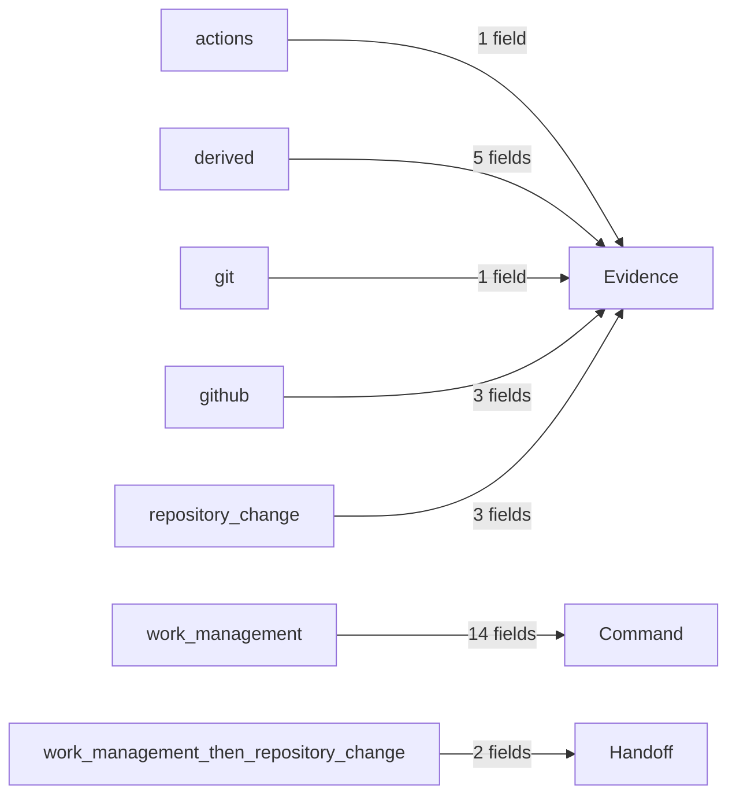

<!-- GENERATED — DO NOT EDIT -->
# Provider and command-plane boundary

[Previous: Authority and reconciliation policy](006-authority-and-reconciliation-policy.md) | [Next: Work Management conformance](008-work-management-conformance.md) | [Index](000-index.md)

The command plane defines the work states and fields that KIS may change. The provider boundary observes and mutates GitHub Project only through the configured read and write models; provider state does not redefine repository-owned facts.

## Authority and handoff flow

Each arrow is derived from the provider-boundary field-authority contract. Labels name the fields carried in that authority direction.

Diagram details:

- `actions` -> `evidence`: Verification.
- `derived` -> `evidence`: Commissioning Key, Delivery Stage, Live Verification, Live Verification Evidence, Project ID.
- `git` -> `evidence`: Authority Revision.
- `github` -> `evidence`: Blocked By, Created, Repository.
- `repository_change` -> `evidence`: Change ID, Complexity, Risk Triggers.
- `work_management` -> `command`: Confidence, Disposition, Effort, Execution Owner, External Link, Iteration, Origin, Priority, Record Type, Review Trigger, Severity, Source Review, Status, Target Date.
- `work_management_then_repository_change` -> `handoff`: Documentation Impact, Module.

## Command-plane model

Claims use **Execution Owner** and do not expire automatically. The completion policy targets `done` and does not require the claim to be absent after close.

The command plane exposes these work states: `inbox`, `triage`, `proposed`, `approved`, `ready`, `active`, `blocked`, `on_hold`, `deferred`, `rejected`, `superseded`, `done`. Delivery uses `none`, `change_created`, `implementing`, `pr_open`, `review`, `ci_pending`, `ci_failed`, `ci_passed`, `merged`, `documentation`, `commissioning`, `complete`.

The intake alias `todo` maps to `inbox`.

### Field authority

The provider adapter uses the field authority defined by the Work Management domain model; it does not maintain a second authority table. See the [Work Management domain model](002-work-management-domain-model.md) and [field reference](020-work-field-and-vocabulary-reference.md).

## Queue and readiness

The executable queue accepts state `ready`. It ranks by `priority`, `effort`, `created_order`, `record_id`, using priority order `critical`, `high`, `medium`, `low` and effort order `tiny`, `small`, `medium`, `large`.

Queue inputs come from **Status**, **Priority**, **Effort**, **Created**, and **Blocked By**.

Before the provider-backed command plane can treat work as Ready, the record **MUST** satisfy its configured readiness requirements:

- The source issue contains **Outcome** and **Acceptance criteria**.
- The Project record contains **Record Type**, **Priority**, **Effort**, and **Documentation Impact**.
- Dependencies are understood.

## State transitions

The provider-facing command plane conforms to the same transition graph as the [Work lifecycle](003-work-lifecycle.md). It validates that graph; it does not define an independent lifecycle copy.

## Delivery projection

**Delivery Stage** carries the derived delivery stage. **Change ID**, **Complexity**, and **Risk Triggers** are projected from repository change governance. The change-created stage is `change_created` and the complete stage is `complete`.

## Provider contract

The configured Project is `NielPieterse0/1`. Reads use bounded inventory and schema observation; writes use preview or idempotent mutation.

Live Project evidence was observed; inventory is complete; the configured Project schema is ready with no field, option, type, or view drift in the captured evidence.

Command-plane schema version: `1`.

## Source and authority

This page projects `KIS-WORK-CTR-SVC-001` version `1.0.1`. The MRD remains authoritative; this generated page has no write-back authority.
